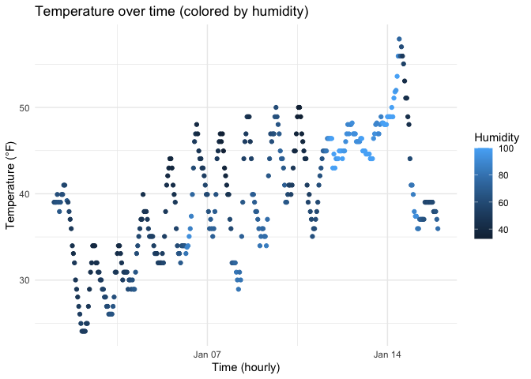

P8105 HW1
================
Dianchen Li
2025-09-16

``` r
data("early_january_weather")
```

# Problem 1

## Dataset Summary

This analysis uses the `early_january_weather` dataset. It has **358**
rows and **15** columns.  
Key variables include the time `time_hour`, air temperature `temp` (°F),
and humidity `humid`.  
The **average temperature** is **39.6 °F**.

``` r
p = ggplot(early_january_weather,
           aes(x = time_hour, y = temp, color = humid)) +
  geom_point() +
  labs(title = "Temperature over time (colored by humidity)",
       x = "Time (hourly)", y = "Temperature (°F)", color = "Humidity") +
  theme_minimal()

p
```

<!-- -->

``` r
ggsave("p1_scatter.png", plot = p, width = 7, height = 4, dpi = 300)
```

**Brief interpretation.**  
There is a increasing trend with daily oscillations. And also the color
shows that the warmer hours are prone to occur with higher humidity. It
is not a linear relationship, there are clusters. But, overall, it still
shows a poistive relationship between temperature and humidity.
